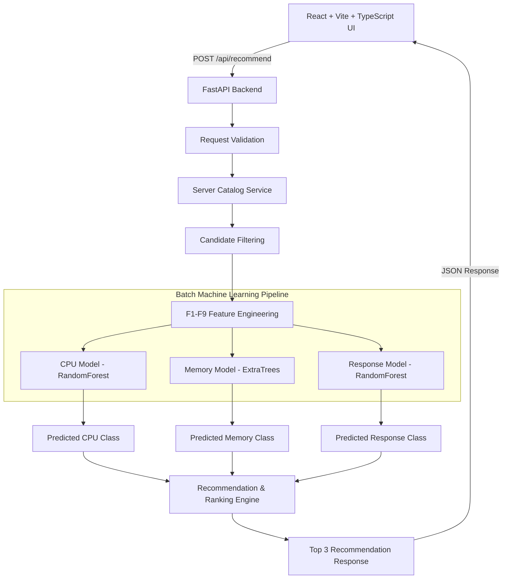

# Cloud Server Recommendation System

An AI-assisted cloud infrastructure sizing system combining a **React + TypeScript** frontend with a **FastAPI + Scikit-Learn** machine learning backend.

The system evaluates application workload requirements (`F1`–`F3`, `F8`–`F9`) against candidate cloud server specifications (`F4`–`F7`) from AWS and Azure using three independent ML classification models (CPU Utilization, Memory Utilization, and Response Time), ranks candidates deterministically, and presents the **Top 3 Recommendations** (Best Balanced, Cheapest Suitable, Best Performance).

---

## 🏗 System Architecture



---

## 📁 Repository Structure

```
ml-hci-new-proj/
├── backend/
│   ├── app/
│   │   ├── api/routes/          # FastAPI endpoints (health, catalog, recommend, models)
│   │   ├── core/                # Config, logger setup
│   │   ├── data/                # Candidate server catalog (JSON abstraction)
│   │   ├── ml/                  # Model registry & batch inference engine
│   │   ├── models/              # Serialized ML models & metadata (cpu, memory, response)
│   │   ├── schemas/             # Pydantic request/response models
│   │   ├── services/            # Catalog, filtering, feature engineering, ranking services
│   │   ├── tests/               # Pytest suite (unit, integration, API, end-to-end)
│   │   └── main.py              # FastAPI application entrypoint
├── ml_pipeline/
│   ├── common.py                # Pipeline constants, dataset paths, label sanitizer
│   ├── validate_dataset.py      # Schema, class distribution, & train/test compatibility check
│   ├── train_model.py           # Multi-algorithm trainer and evaluator
│   ├── train_cpu.py             # CPU model trainer (mmc5 -> mmc2)
│   ├── train_memory.py          # Memory model trainer (mmc6 -> mmc3)
│   ├── train_response.py        # Response Time model trainer (mmc7 -> mmc4)
│   └── evaluate.py             # Report generator
├── scripts/
│   ├── validate_all.py          # Execute dataset validation
│   ├── train_all.py             # Train all 3 ML models
│   ├── evaluate_all.py          # Generate evaluation report
│   └── benchmark.py             # Run batch performance benchmark
├── data/
│   ├── train/ (mmc5.xlsx, mmc6.xlsx, mmc7.xlsx)
│   └── test/  (mmc2.xlsx, mmc3.xlsx, mmc4.xlsx)
├── reports/
│   ├── model_evaluation.json
│   ├── model_evaluation.md
│   └── performance_benchmark.json
├── src/                         # React + Vite Frontend
│   ├── components/
│   ├── data/
│   ├── services/                # recommendationApi.ts connected to FastAPI
│   └── types/
├── package.json
└── README.md
```

---

## 📊 Dataset Mapping

| Target Model | Training Dataset | Testing Dataset | Feature Inputs | Target Column |
| :--- | :--- | :--- | :--- | :--- |
| **CPU Utilization** | `data/train/mmc5.xlsx` | `data/test/mmc2.xlsx` | F1–F9 | `Class_Name` |
| **Memory Utilization** | `data/train/mmc6.xlsx` | `data/test/mmc3.xlsx` | F1–F9 | `Class_Name` |
| **Response Time** | `data/train/mmc7.xlsx` | `data/test/mmc4.xlsx` | F1–F9 | `Class_Name` |

---

## ⚙️ Feature Engineering (F1–F9)

| Feature | Description | Origin |
| :--- | :--- | :--- |
| **F1** | `Jobs_per_1Minute` | User Workload |
| **F2** | `Jobs_per_5Minutes` | User Workload |
| **F3** | `Jobs_per_15Minutes` | User Workload |
| **F4** | `Mem_capacity` (GB) | Candidate Server |
| **F5** | `Disk_capacity` (GB) | Candidate Server |
| **F6** | `Num_of_CPU` (Cores/vCPU) | Candidate Server |
| **F7** | `CPU_speed` (GHz) | Candidate Server |
| **F8** | `Avg_Receive_Kbps` | User Workload |
| **F9** | `Avg_Transmit_Kbps` | User Workload |

---

## 🏆 Model Evaluation Results

| Target Model | Selected Algorithm | Test Accuracy | Macro F1 | Weighted F1 | Training Samples | Test Samples |
| :--- | :--- | :---: | :---: | :---: | :---: | :---: |
| **CPU Utilization** | `RandomForestClassifier` | **96.82%** | **0.8106** | **0.9666** | 25,697 | 2,450 |
| **Memory Utilization** | `ExtraTreesClassifier` | **98.04%** | **0.9035** | **0.9799** | 25,697 | 2,450 |
| **Response Time** | `RandomForestClassifier` | **96.65%** | **0.8019** | **0.9648** | 25,697 | 2,450 |

---

## 🚀 Execution Commands

### 1. Dataset Validation
```bash
PYTHONPATH=. ./venv/bin/python scripts/validate_all.py
```

### 2. Model Training & Artifact Generation
```bash
PYTHONPATH=. ./venv/bin/python scripts/train_all.py
```

### 3. Model Evaluation Report
```bash
PYTHONPATH=. ./venv/bin/python scripts/evaluate_all.py
```

### 4. Run Backend Tests
```bash
PYTHONPATH=. ./venv/bin/pytest backend/app/tests/
```

### 5. Performance Benchmark
```bash
PYTHONPATH=. ./venv/bin/python scripts/benchmark.py
```

### 6. Start FastAPI Backend
```bash
PYTHONPATH=. ./venv/bin/uvicorn backend.app.main:app --reload --port 8000
```

### 7. Run Frontend Development Server
```bash
npm run dev
```

---

## 🌐 API Endpoints

- `GET /health`: Health status of API, ML models, and catalog.
- `GET /api/catalog`: List all candidate cloud servers in catalog.
- `GET /api/catalog/{server_id}`: Retrieve specification of a single server.
- `POST /api/recommend`: Primary workload recommendation endpoint.
- `GET /api/models/status`: Check load status and accuracy of trained models.
- `GET /api/models/metrics`: Return full evaluation report for all models.

---

## ⚡ Performance Benchmark Summary

Evaluated using batch vector predictions across all candidates:
- **10 candidates**: 76.88 ms
- **100 candidates**: 41.89 ms
- **500 candidates**: 45.85 ms
- **1,000 candidates**: 42.90 ms

---

## ⚠️ Known Limitations & Future Work

1. **Academic/Research Datasets**: The ML models are trained on specific academic workload benchmarks (`mmc2`–`mmc7`). Production environments should incorporate continuous online model retraining.
2. **Catalog Persistence**: Current catalog uses a JSON abstraction layer. In production, this can be seamlessly swapped with PostgreSQL via `catalog_service.py`.
